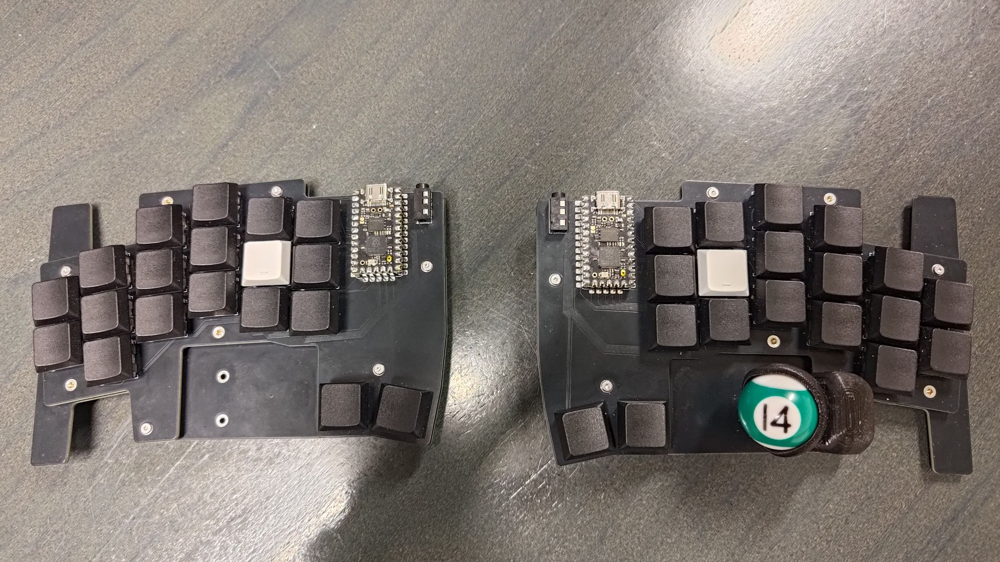

# Kivipallur
A split ergo keyboard with a 25 mm thumb trackball.

## Features
- 38 keys
- split, colstag
- diodeless, only 0xCB Helios compatible (good amount of pins, no separate reset switch needed)
- hot-swap Choc v1
- 25 mm trackball with PMW3360 breakout

Layout was created with Ergogen.
I tested it by printing it out on paper and cutting out switch holes from cardboard.

Since I opted for low-profile switches, I also tried a smaller ball, since a ball holder design was available on Thingiverse.
I didn't make a CAD model and due to not accounting for everything in my head, had to modify the holder height a bit.
But it doesn't make it any more uncomfortable to use.

Finding a 25 mm trackball proved difficult, so I tried a steel ball, a silicon nitride ball, and a kids pool set 25 mm ball.
Surprisingly, the pool ball worked best.
Coming from a standard 34 mm ball, I don't feel the smaller ball performs worse.
The trackball sits on 2 mm silicon nitride static bearings. No noticable stiction, friction reasonable for flicks.

QMK config found in my `qmk-userspace` fork.

I started out with 3D printed tenting feet, but moved on to camera mounts.
Bottom plate has M2 holes, which allow for heat-set inserts in addons.
Tenting feet and camera mount attachment with 3D printed thread designed myself.

## Thank-yous
Yowkees for the Keyball

GEIST for the Totem

MrZealot for Ergogen

FlatFootFox for Ergogen tutorials

kepeo for [25 mm trackball holder](https://www.thingiverse.com/thing:6719828)
